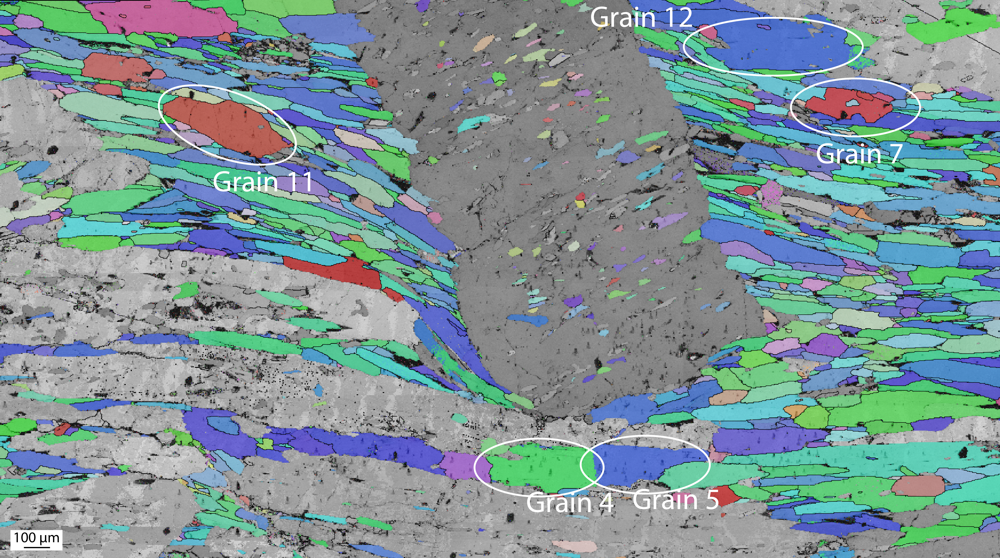
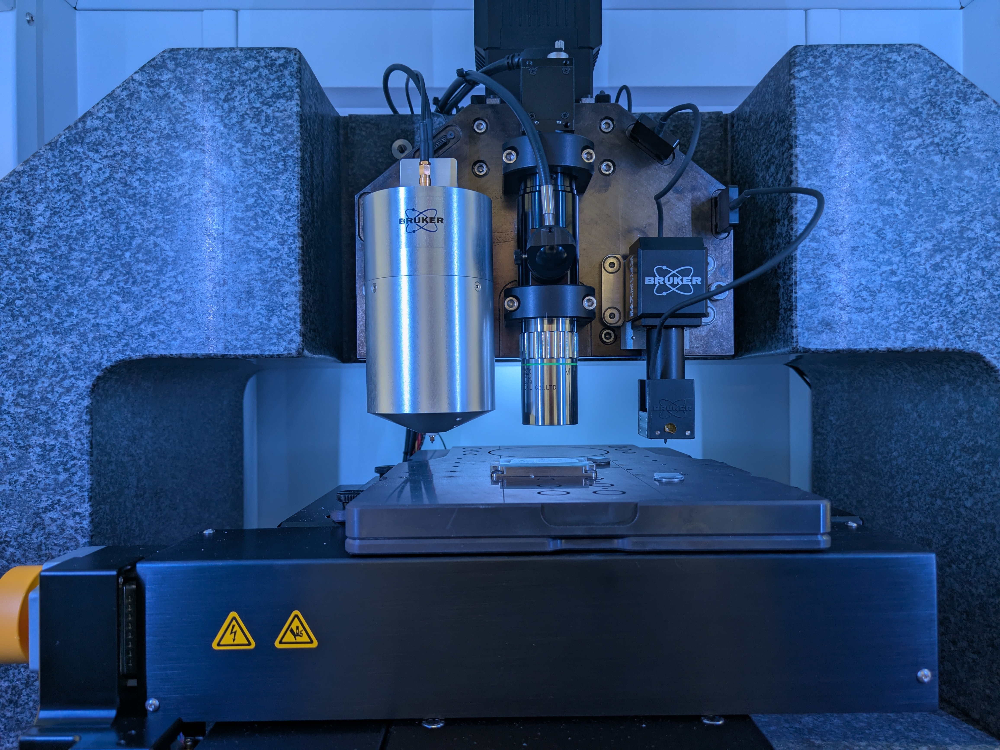

# 🧪 Experimental Metadata Reference

This section documents important metadata fields collected during nanoindentation experiments using the Hysitron TI 990 system. These variables are useful for preprocessing raw data, validating test conditions, and performing downstream statistical analysis.

---

## 📐 Metadata Variables Explained

### `Acquisition_Contact_Threshold__μN__`
- **Description**: Force threshold at which the machine determines that contact has been made.
- **Use case**: Important for **preprocessing**. The region before this threshold typically contains fake contact cycles and should be trimmed.
- **Note**: Marks the true start of the indentation curve.

---

### `Initial_Drift_Rate__nm___s__`
- **Description**: Rate of displacement drift while the tip is held stationary at the start of the experiment.
- **Use case**: Useful for assessing **environmental stability** and potential corrections during analysis.
- **Related field**: `Acquisition_Drift_Monitor_Time__s__` specifies how long drift was measured.
- **Insight**: High drift rates may indicate unstable conditions (e.g., thermal fluctuations).

---

### `Acquisition_Lift_Height__nm__`
- **Description**: Distance the indenter tip is lifted away from the sample before initiating the actual indentation.
- **Use case**: Helps interpret displacement values **below 0 nm** in raw data, which should be trimmed during preprocessing.

---

### `Acquisition_Maximum_Demand__µN__`
- **Description**: Maximum force applied during the indentation.
- **Use case**: Critical for verifying test configuration:
  - **6 µm tip** → ~200 mN
  - **3 µm tip** → ~100 mN
- **Note**: Inconsistent maximum demand values may indicate incorrect experimental parameters.

---

### `Current_Area_Function_B`, `C0`, `C1`, ..., `C5`
- **Description**: Polynomial coefficients used to model the **contact area** of the tip as a function of depth:
  
  \[
  A(h) = C_0 h^2 + C_1 h + C_2 h^{0.5} + \dots + C_5 h^{-2}
  \]

- **Use case**: Necessary for accurate **calculation of hardness and stress**.
- **Explanation**: The shape of the indenter tip may deviate from ideal geometry; these coefficients correct for that.

---

### `Current_Tip_Modulus__MPa__`
- **Description**: Young’s modulus of the indenter tip material.
- **Use case**: Required in modulus and hardness calculations (e.g., reduced modulus).

---

### `Current_Tip_Poissons_Ratio`
- **Description**: Poisson’s ratio of the tip.
- **Use case**: Used in stress-strain calculations and corrections based on contact mechanics.

---

## 🔍 Summary Table

| Variable                                | Unit       | Purpose                           |
|----------------------------------------|------------|------------------------------------|
| `Acquisition_Contact_Threshold__μN__`  | μN         | Trim pre-contact region           |
| `Initial_Drift_Rate__nm___s__`         | nm/s       | Environmental quality check       |
| `Acquisition_Lift_Height__nm__`        | nm         | Detect trimmed offset region      |
| `Acquisition_Maximum_Demand__µN__`     | μN         | Validate experiment configuration |
| `Current_Area_Function_B`, `C0..C5`    | varies     | Calibrate contact area            |
| `Current_Tip_Modulus__MPa__`           | MPa        | Used in modulus calculation       |
| `Current_Tip_Poissons_Ratio`           | dimensionless | Stress-strain relations        |

---

### 🧰 Additional Notes

- All metadata fields are parsed from the `.tdm` files exported by Hysitron's software.
- These fields can be accessed using `load_tdm()` in the `merrypopins.load_datasets` module.
- Consider saving metadata alongside each test’s main `.txt` dataset for reproducibility and auditing.

# 🔬 Experimental Setup and File Naming Conventions

This page outlines the experimental equipment, procedure, file naming scheme, and specific loading parameters used in the indentation experiments analyzed by **merrypopins**.

---

## 🧪 Instrumentation

All nanoindentation experiments were performed using the **Bruker Hysitron TI 990 TriboIndenter**, a precision instrument for measuring mechanical properties at the nanoscale.

- **Transducer**: 3D OMNIProbe
  - **Max Load**: 10 N
  - **Max Displacement**: 80 µm
- **Displacement Resolution**: < 0.01 nm
- **Displacement Noise Floor**: 0.5 nm
- **Force Resolution**: 0.0014 mN
- **Force Noise Floor**: 0.07 mN
- **Control Software**: TriboScan 12.0.0.391
- **Tip Type**: Conospherical diamond
  - 6 µm tip actual radius: **5.323 µm**
  - 3 µm tip actual radius: **3.064 µm**

**Calibration Materials**:
- Fused Quartz
- Polycarbonate

---

## 🧱 Sample Preparation

The sample used is a thin-section of **blueschist**, a metamorphic rock rich in:
- Glaucophane
- Zoisite
- Garnet
- Phengite

**Preparation Process**:
- Cut to 30 µm thickness and mounted on a glass slide.
- Mechanically polished using aluminum oxide.
- Chemically polished using colloidal silica.
- **Grain Selection**: 12 glaucophane grains selected based on crystallographic orientation via electron backscatter diffraction (EBSD).

---

## ⚙️ Experimental Parameters

### Tip Radius & Load Settings

| Tip Type     | Nominal Radius | Actual Radius | Peak Load |
|--------------|----------------|---------------|-----------|
| 6 µm         | 6 µm           | 5.323 µm      | 200 mN    |
| 3 µm         | 3 µm           | 3.064 µm      | 100 mN    |

### Loading Profiles

| Type          | Ramp Duration | Notes                        |
|---------------|---------------|------------------------------|
| Fast Loading  | 20 seconds    | Shorter load ramp duration   |
| Slow Loading  | 60 seconds    | Gentler loading phase        |

All other parameters (e.g., hold, unload) were identical across experiments.

---

## 📂 File Naming Convention

Each experiment file name consists of **six components** separated by underscores:

- grain<size>_<tip_radius>_<name_or_number>_<HL/LL>_<QS/DMA>_<LC/DC/OL>.tdm

### Example: `grain5_6um_01_HL_QS_LC.tdm`

### Components

| Part           | Description                                                                 |
|----------------|-----------------------------------------------------------------------------|
| `grain`        | Denotes experiment location or group                                        |
| `size`         | Tip radius **(approximate; may update to actual radius in future)**         |
| `name+number`  | Label for experiment within the grain group                                 |
| `HL` or `LL`   | Transducer: HL = High Load, LL = Low Load                                   |
| `QS` or `DMA`  | Mode: QS = Quasistatic, DMA = Continuous Property Measurement              |
| `LC/DC/OL`     | Load Control: LC = Load-Controlled, DC = Displacement-Controlled, OL = Open Loop |

> 🧠 _Note_: While the last three identifiers are mostly used by the acquisition software, they may still hold value for sorting and statistical comparison. They're not essential for preprocessing but may help in interpreting mechanical response differences.

---

## 🗂 Mapping Tip & Load Speed (6 Micron Tip)

| File Identifier | Peak Load | Loading Type |
|-----------------|-----------|--------------|
| 6um             | 200 mN    | Fast/Slow*   |

> *Fast = 20s ramp, Slow = 60s ramp — not always obvious from the file name alone; must be manually mapped.*

---

---

## 📸 Experimental Images

Below are a series of microstructural and equipment images related to the nanoindentation experiments.

### 🔬 Electron Backscatter Diffraction (EBSD) Maps

These EBSD maps show the microstructural grains in the blueschist rock sample.

#### 1. Inverse Pole Figure (IPF) Coloring

#### 2. Phase Map with Mineral Segmentation

### 📍 Grain Selection for Indentation

The following image shows selected grains (e.g., Grain 4, 5, 7, 11, 12) that were targeted for indentation:

### 🧪 Instrumentation

The nanoindentation experiments were conducted using the Bruker Hysitron TI 990 TriboIndenter.

#### 1. Close-up of the Tip and Sample Stage

#### 2. Full View of the Instrument

